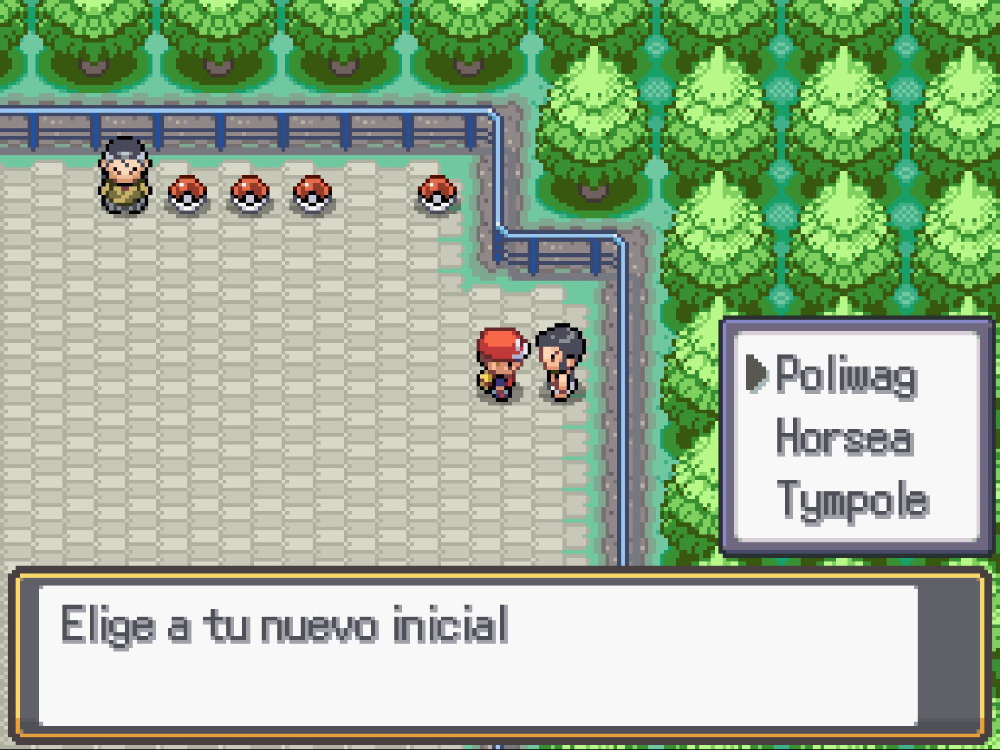
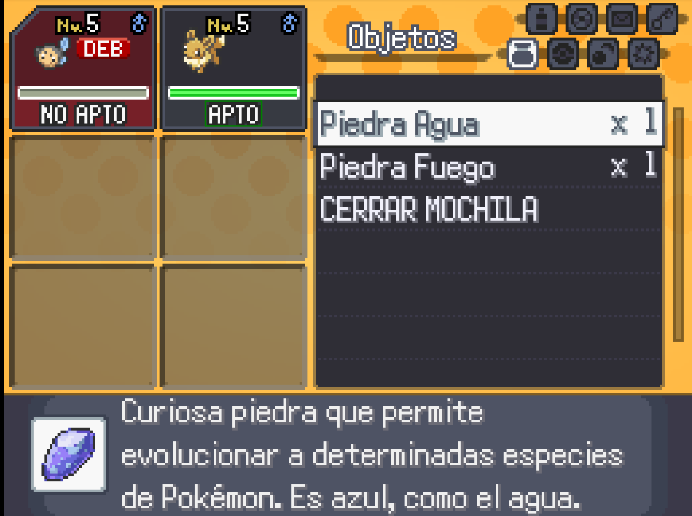

# Modo Monotype

## Descripción

Este plugin les permitirá hacer un desafío mono tipo en sus fangames. El jugador podrá elegir el tipo y solo se le permitirá capturar a los Pokémon de ese tipo o que tengan una evolucion de ese tipo. Al activarlo le eliminará del equipo todos sus Pokémon que no cumplan con el tipo, si no tiene ningun Pokémon que cumpla con el tipo, se le dará a elegir entre 3 nuevos iniciales del tipo elegido, de un listado definido en el script.





### Con el flag `BLOQUEAR_EVOLUCIONES_A_OTROS_TIPOS` activado

#### Con piedra agua



#### Con piedra fuego


## Configuración

En el script hay una constante llamada `TYPES` en esta constante se definen los tipos que consideran que en sus juegos es viable hacer un reto monotipo.

`STARTER_OPTIONS` en starter options se define el listado de iniciales que se tomará aleatoriamente 3 para que el jugador elija como uno como inicial para su reto monotype.

`BLOQUEAR_EVOLUCIONES_A_OTROS_TIPOS` el valor por defecto de esta constante es false. Si lo cambian a true no permitirá a los pokémon evolucionar a pokemón que no sean del tipo del reto monotype. Por ejemplo en un monotipo agua Eevee siempre será capturable, y podrá evolucionar a Vaporeon pero no a Jolteon.

## Implementación

1. Descargar el script del ultimo [release](https://github.com/Pokemon-Fan-Games/Modo-Monotype/releases/tag/16_BES_v1.0.0).
2. Crear el siguiente evento para activar el reto.
   1. 
   2. Primero hay que hacer un show choices preguntando si se desea activar el modo.
   3. Pidan una confirmacion ya que al activarlo se borrará el primer pokemon del equipo.
   4. Una vez confirmado hay que agregar al evento una sentencia de script con el siguiente código:
      ```ruby
       options = MonotypeChallenge.type_options
       ret = Kernel.pbMessage('Elige el tipo para tu reto', options)
       MonotypeChallenge.type = ret
      ```
   5. Luego de esto ponen una conditional branch de tipo script con la siguiente linea `MonotypeChallenge.enabled?`
   6. En el true de ese conditional branch ponen otra conditional branch que es la que se encargará de eliminar a los pokemon no validos del equipo. La conditional branch debe tener la siguiente linea: `!MonotypeChallenge.valid_monotype?($Trainer.party[0])`
   7. En el true de esa conditional branch llaman al siguiente script para que el jugador pueda elegir a su nuevo inicial `MonotypeChallenge.choose_starter`